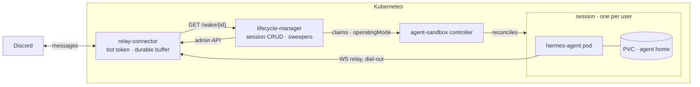

# hermes-cluster

Personal [Hermes agents](https://github.com/NousResearch/hermes-agent) as
managed, persistent, **scale-to-zero** sessions on Kubernetes. One session =
one stateful pod with its whole home directory on a PVC — suspended to
disk-only cost when idle, woken in seconds by an incoming Discord message.

This repo is the platform library:

- **lifecycle-manager** — a small, stateless Go service: session CRUD over
  HTTP, `/wake`, idle + TTL sweepers, connector integration, reconcile
  report. Image: `ghcr.io/nabi-allenby/hermes-cluster/lifecycle-manager`.
- **hermes-cluster chart** — the whole platform as one Helm release:
  `oci://ghcr.io/nabi-allenby/hermes-cluster/charts/hermes-cluster`.

The hard problems are delegated to pinned externals:
[kubernetes-sigs/agent-sandbox](https://github.com/kubernetes-sigs/agent-sandbox)
(session pods, PVC survival, suspend/resume) and
[hermes-relay-connector](https://github.com/nabi-allenby/hermes-relay-connector)
(Discord token custody, durable buffering, wake pokes — optional; without it
this is a generic session orchestrator).



## Proven, with numbers

Every acceptance criterion has passed **live** (measured reference:
[docs/architecture.md](docs/architecture.md)):

| What | Measured |
|---|---|
| Discord DM → agent reply, agent pod on AKS | end-to-end conversation |
| Idle → suspended to disk-only | 8 s (graceful `going_idle`) |
| DM while suspended → wake → connected | **~22 s** on AKS (managed-csi attach ≈ 15 s); ~6 s on minikube |
| Decommission (`DELETE`) → connector purge + pod/PVC cascade | ~6 s |
| Suspended-session density | 11 sessions on a node that runs 6 |

## Install (Helm)

Prereqs: agent-sandbox v0.5.4 CRDs + controller installed, one required
Secret (the seed home with the LLM key) and, for Discord, an optional
bot-token Secret (see [charts/README.md](charts/README.md)).

```bash
helm install hermes oci://ghcr.io/nabi-allenby/hermes-cluster/charts/hermes-cluster \
  --version 0.2.2 -n hermes --create-namespace
```

Then create a session and talk to your bot:

```bash
kubectl -n hermes port-forward svc/hermes-lifecycle-manager 8080:8080 &
curl -X POST localhost:8080/v1/sessions -H 'Content-Type: application/json' \
  -d '{"connector":{}}'
```

Full HTTP API: [docs/api.md](docs/api.md). Agent image: official
multi-arch [`nousresearch/hermes-agent`](https://hub.docker.com/r/nousresearch/hermes-agent)
(pin a release tag, never `latest`).

## Local development (minikube)

```bash
make minikube-up      # minikube + agent-sandbox v0.5.4
make drill-substrate  # claim → suspend → PVC survives → resume
make drill-agent      # full agent: boot → connect → suspend → wake → drain
make test             # unit suite
make e2e              # e2e tiers 1-2 vs minikube (+docker)
```

Or run the lifecycle-manager bare against any kubeconfig:

```bash
kubectl apply -f test/fixtures/template.yaml
HLM_WARM_POOL=e2e-pool make run-local
```

## How it works

One session = one `SandboxClaim` = one `Sandbox` = one PVC. The
lifecycle-manager is **stateless**: per-session knobs are claim annotations;
live state is derived on read and never stored; restarts lose nothing.

Two sweepers are the only writers of lifecycle intent:

- **Idle sweeper** (connector mode only): suspends sessions that are Ready,
  quiet past their idle timeout, with no turn in flight and nothing
  buffered. Unknown activity (connector restart) is never treated as idle.
- **TTL sweeper**: decommissions expired sessions through the same single
  code path as `DELETE /v1/sessions/{id}` — connector purge first, then
  claim deletion (cascades pod + PVC).

The wake loop: message to a suspended agent → connector buffers durably →
pokes `GET /wake/{id}` → lifecycle-manager patches
`operatingMode: Running` → pod recreates on the same PVC → gateway
re-dials → backlog drains in order. A lost poke degrades to
delivery-on-next-resume, never loss.

## Configuration (env)

| Var | Default | Notes |
|---|---|---|
| `HLM_LISTEN` | `:8080` | HTTP listener |
| `HLM_NAMESPACE` | in-cluster / `default` | namespace for claims |
| `HLM_WARM_POOL` | **required** | default `SandboxWarmPool` for new sessions (a `replicas: 0` pool = cold-start everything) |
| `HLM_SANDBOX_API_GROUP` / `HLM_SANDBOX_EXT_API_GROUP` / `HLM_SANDBOX_API_VERSION` | `agents.x-k8s.io` / `extensions.agents.x-k8s.io` / `v1beta1` | CRD pin knobs |
| `HLM_SWEEP_INTERVAL` | `60s` | sweep cadence (jittered) |
| `HLM_IDLE_TIMEOUT` | `30m` | global idle timeout; `0` disables |
| `HLM_TTL` | `0` | global session TTL; `0` disables |
| `HLM_API_TOKEN(_FILE)` | unset | optional bearer on `/v1/*` (never `/wake`/health) |
| `HLM_CONNECTOR_ENABLED` | `false` | enable the relay-connector integration |
| `HLM_CONNECTOR_URL` | — | connector **admin-plane** base URL (reachability probed via unauthenticated `/metrics`) |
| `HLM_CONNECTOR_ADMIN_TOKEN(_FILE)` | — | bearer for `/admin/v1/*` |
| `HLM_CONNECTOR_PROVISION_TOKEN(_FILE)` | — | bearer for `POST /relay/provision`; unset ⇒ agent self-provision only |
| `HLM_CONNECTOR_BOT_ID` / `HLM_CONNECTOR_PLATFORM` | — / `discord` | provision parameters |
| `HLM_WAKE_BASE_URL` | — | base for registered wake URLs (`<base>/wake/<id>`) |
| `HLM_ORPHAN_POLICY` | `report` | claims↔instances drift is reported in `/status`, never auto-deleted |
| `HLM_STATUS_ENABLED` | `false` | Idle v2: poll session pods' `/api/status` so suspends key off agent-reported activity (requires the chart's serve container) |
| `HLM_STATUS_PORT` / `HLM_STATUS_TIMEOUT` | `9119` / `3s` | serve-container port and per-poll timeout |
| `HLM_STATUS_BASIC_AUTH_USERNAME` / `HLM_STATUS_BASIC_AUTH_PASSWORD(_FILE)` | unset | credential for the auth-gated cron schedule; both unset skips the cron gate |
| `HLM_IDLE_HORIZON` | `5m` | a cron fire within this window blocks the suspend |
| `HLM_WAKE_BOOT_MARGIN` | `2m` | scheduled wakes fire this early before the cron |
| `HLM_LOG_LEVEL` / `HLM_LOG_FORMAT` | `info` / `json` | logging |

Durations accept Go syntax (`30m`) or bare seconds (`1800`). `*_FILE`
variants win over their plain twins.

Connector-client discipline (encoded in `internal/connector`): **no retries
anywhere** — the connector throttles auth failures per source IP and its
429s hit good credentials too; any 429 short-circuits all calls for 65 s and
the sweep cadence is the retry loop.

## Repo map

| Path | What |
|---|---|
| `lifecycle-manager/` | the Go service (unit + e2e tests) |
| `charts/hermes-cluster/` | the platform chart (published as OCI on `chart-v*` tags) |
| `docs/` | architecture, HTTP API, agent-sandbox substrate facts |
| `test/` | local test env (minikube), e2e fixtures, live drills ([test/README.md](test/README.md)) |
| `CONTRIBUTING.md` | setup, test ladder, design ground rules |
| `docs/architecture.md` | the system design in one page |

## Pins

| Dependency | Version | Notes |
|---|---|---|
| agent-sandbox | `v0.5.4` | facts + measured timings in [docs/agent-sandbox.md](docs/agent-sandbox.md); bump ⇒ re-verify that file |
| hermes-relay-connector | `0.2.0` | public on GHCR; contract notes in `internal/connector` |
| hermes-agent | `v2026.8.3` (≈ `@244d296`) | official Docker Hub image, multi-arch; relay contract conformance-verified at the pin |

License: MIT.
