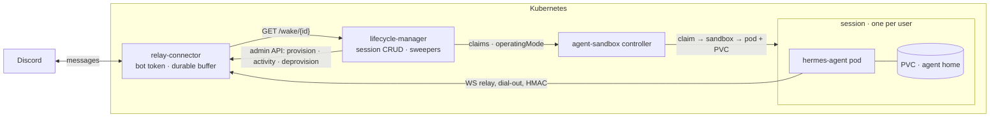
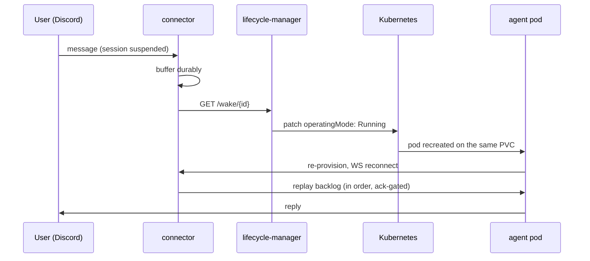

# System architecture

Personal Hermes agents as managed, persistent, scale-to-zero sessions on
Kubernetes. One session = one stateful pod with its whole home directory on
a PVC — suspended to disk-only cost when idle, woken by an incoming message.

## Components

| Component | Role | Owns |
|---|---|---|
| **lifecycle-manager** (this repo) | stateless HTTP service: session CRUD, `/wake`, idle + TTL sweepers, reconcile report | lifecycle intent — nothing else |
| [agent-sandbox](https://github.com/kubernetes-sigs/agent-sandbox) (pinned, unmodified) | `SandboxClaim`/`SandboxTemplate`/`SandboxWarmPool`/`Sandbox` CRDs: one stateful pod per session, PVC survival, suspend/resume, cascade delete | pod/PVC mechanics |
| [hermes-relay-connector](https://github.com/nabi-allenby/hermes-relay-connector) (pinned image, optional) | Discord front: token custody, durable message buffer, wake pokes, per-instance activity | platform credentials, message durability |
| session pods (official `nousresearch/hermes-agent` image) | the agents themselves; dial out to the connector over WS+HMAC | their own home directory |

Without the connector the lifecycle-manager is a generic session
orchestrator: no idle detection (no activity signal — it never guesses) and
no messaging, but CRUD, `/wake`, and TTL work unchanged.

## Session model

- **One id everywhere**: session id = claim name = connector gatewayId =
  pod name (DNS-1123; generated `s-<10 hex>` if absent). Cold starts keep
  pod == claim; warm-pool adoption would break that equality, so pools run
  `replicas: 0` (cold-start everything).
- **The claim is the database.** The lifecycle-manager stores nothing:
  label `hermes.nabi.dev/managed=true` scopes the sweepers; annotations
  `hermes.nabi.dev/{ttl-seconds, idle-timeout-seconds, connector,
  display-name}` carry per-session knobs. A restart rebuilds everything
  from the claim list plus the connector instance list.
- **State is derived on read, never stored:**

| operatingMode | conditions | derived state |
|---|---|---|
| — (no sandbox) | — | `Pending` |
| `Running` | `Ready=True` | `Ready` |
| `Running` | Ready not True | `Waking` |
| `Suspended` | `Suspended=True` | `Suspended` |
| `Suspended` | Suspended not True | `Suspending` |
| any | claim deletionTimestamp | `Terminating` |

## Lifecycle flows

**Create** (`POST /v1/sessions`): create the claim; with a connector block,
also provision the gateway (wakeUrl = `<base>/wake/<id>`) and bind chat
routes — with full rollback if any step fails. The returned gateway secret
is discarded: the pod self-provisions on boot and rotates it inside the
connector's two-deep verify window.

**Session pod boot** (every boot, cold or resume): an init container seeds
the four home files (`.env`, `auth.json`, `config.yaml`, `SOUL.md`) from a
Secret **only when absent** — resumed state is never overwritten. Then the
pod re-provisions its relay credentials against the connector and starts
the gateway. Provision keeps an already-registered wakeUrl.

**Suspend** (idle sweeper only, connector mode): requires all of — state
`Ready` · effective idle timeout > 0 · Ready-condition older than the
timeout · instance exists, not revoked · no turn in flight · both activity
timestamps known and older than the timeout · nothing buffered. Unknown
activity (e.g. after a connector restart) is never idle. Suspend = patch
`Sandbox.spec.operatingMode: Suspended`; the controller deletes the pod and
keeps the PVC and Service.

**Wake** — a lost poke degrades to delivery-on-next-resume, never loss;
`/wake` is idempotent (payload-free, unauthenticated, cooldown-limited) and
safe mid-suspension:

**Decommission** — exactly one code path, used by `DELETE /v1/sessions/{id}`
and the TTL sweeper: connector deprovision first (purges buffer, routes,
gateway row; 404 = already done), then claim delete (cascades sandbox, pod,
Service, PVC). If deprovision fails the claim is kept and the next sweep
retries — claim existence is the retry state. `spec.lifecycle` on claims is
never used.

## Network model

Enforced by the chart's NetworkPolicies (needs an enforcing CNI):

- **Sessions**: egress to the connector and HTTPS only; no ingress — agents
  dial out.
- **Connector**: ingress from sessions and the lifecycle-manager; egress to
  Discord (HTTPS), wake pokes to the lifecycle-manager, DNS.
- **lifecycle-manager**: ingress only from the connector (wake pokes);
  operator access via `kubectl port-forward`, which NetworkPolicy does not
  gate. Egress to the Kubernetes API and the connector admin plane.

RBAC is minimal: claims (full lifecycle) and sandboxes (read + patch), in
both API groups agent-sandbox uses — nothing else, no pods or secrets.

## Failure semantics

- **Connector client never retries.** The connector throttles repeated auth
  failures per source IP and its 429s hit good credentials too; any 429
  short-circuits all calls for the throttle window and the sweep cadence is
  the retry loop.
- **lifecycle-manager restart loses nothing** — all truth is in claims,
  sandboxes, and connector state.
- **Node loss ≡ involuntary suspend**: the connector buffers, the
  controller reschedules, the PVC reattaches.
- **Orphan drift** (claims without instances or vice versa) is reported at
  `/status`, never auto-deleted.

## API surface

`POST/GET /v1/sessions` · `GET/DELETE /v1/sessions/{id}` ·
`POST /v1/sessions/{id}/restart` ·
`GET|POST /wake/{session}` · `GET /healthz|/readyz|/status`. Optional bearer
guards `/v1/*` only — `/wake` stays unauthenticated by design (the poke is
a bare GET). Full reference: [api.md](api.md).

## Pins and upgrade rules

| Dependency | Pin | Upgrade rule |
|---|---|---|
| agent-sandbox | v0.5.4 | re-verify every fact in [agent-sandbox.md](agent-sandbox.md); all CRD field paths live in `internal/k8s/unstructured.go` and nowhere else |
| hermes-relay-connector | 0.2.0 | re-read its HTTP API against `internal/connector`; rerun e2e tier 2 |
| hermes-agent | `v2026.8.3` (≈ `244d296`) | the relay contract is conformance-verified at the pin; bump via the connector's conformance gate |

## Measured reference (live runs)

| Step | minikube (hostpath) | AKS (managed-csi) |
|---|---|---|
| claim create → pod Ready | 2.8 s | 17 s (disk attach ≈ 15 s) |
| pod Ready → gateway connected | 2.7 s | 5 s |
| idle suspend (graceful gateway exit) | 4 s | 8 s |
| message → connected wake, end to end | ~6 s | ~22 s (budget: ≤30 s target, ≤60 s hard) |
| decommission: purge + full cascade | ~6 s | ~6 s |
